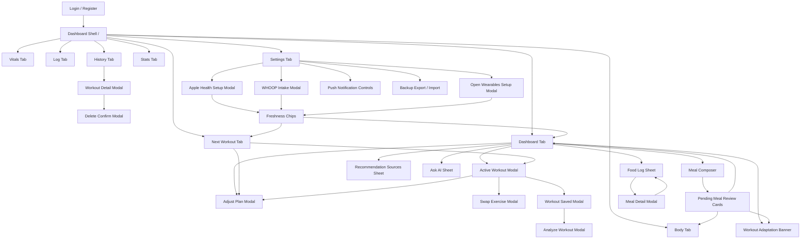

# Page Relationships

> **Sources:** `templates/index.html`, `static/js/app.js`, `static/js/sw.js`, `app.py`, `auth.py`, `apple_health_parser.py`, `data_store.py`, `workout_adaptation.py`
> **Routes:** Navigation, modal, refresh, and data-coupling relationships across the app shell.
> **Generated:** 2026-07-08 (reverse-engineered from code, FIT-268)

## Navigation Model

The main product surface is one authenticated app shell at `/`. Primary navigation is an eight-button tab bar in `templates/index.html`: Dashboard, Vitals, Next, Log, History, Body, Stats, Settings. Tab switching is client-side (`data-tab` -> `#tab-*`) and hash-aware; the backend does not render separate pages for each tab.

The app uses modals/sheets for secondary flows instead of route navigation. Important modals include exercise swap, recommendation sources, Ask AI, WHOOP intake, Open Wearables setup, Adjust Plan, Analyze Workout, Workout Detail, Meal Detail, Food Log, Delete confirmation, Apple Health setup, Active Workout, Workout Saved, and Pending Sync.

Public/auth pages are separate server-rendered templates: login/register via `auth.py`, and billing/marketing templates via `stripe_checkout.py`/`templates`. In this checkout, `stripe_bp` is never registered and `/landing` has no route.

## High-Level Page/Data Diagram

## Initial Load And Shared Refreshes

On boot, `static/js/app.js` renders only the initial hash-selected tab. Dashboard is the default initial tab and fetches:

- `/api/dashboard`, `/api/oura/status`, `/api/recommendation/smart`, `/api/oura/sleep-summary`, `/api/oura/trends`, and `/api/history-all`.
- Other tabs lazy-load and cache their data on first visit; the union of per-tab endpoints includes `/api/next-workout`, `/api/vitals`, `/api/whoop/status`, `/api/open-wearables/status`, `/api/wearable-sources`, `/api/insights`, `/api/apple-health/workouts`, `/api/body-history`, `/api/settings`, `/api/analytics/advanced`, `/api/muscle-fatigue`, and `/api/exercises`.
- Dashboard, next workout, Oura status/sleep, WHOOP status, Open Wearables status, wearable sources, and smart recommendation use a 30-second timeout where configured.
- AI status uses `/api/ai/health` and `/api/ai/metrics`, with a 60-second refresh interval after boot.
- Push state reads `/api/push/subscriptions`, `/api/push/reminders/preview`, and `/api/push/vapid-public-key` only when the push card is rendered/interacted with.

Shared state relationships:

| Source action | Immediate API | Surfaces refreshed or affected |
| --- | --- | --- |
| Open app shell | Initial tab GETs listed above | Initial tab only; other tabs populate on first switch. |
| Retry readiness/recommendation/insights | `/api/oura/status` (readiness), `/api/dashboard` + `/api/recommendation/smart` (recommendation), `/api/oura/sleep-summary` (insight) | Readiness card, recommendation card, source chips, insight card. |
| Change settings goal/time/equipment | `/api/settings` or `/api/settings/equipment` | Next workout, smart recommendation, Settings summaries, Dashboard recommendation. |
| AI status timer | `/api/ai/health`, `/api/ai/metrics` | Header AI dot/popover and Settings AI coach card. |
| Source freshness read | `/api/freshness` | Settings integration chips and freshness detail; used there specifically because `/api/dashboard` would regenerate `next_workout`. Dashboard freshness chips instead read freshness blocks inside `/api/dashboard` and `/api/recommendation/smart` payloads. |

## Workout Flow Relationships

| Trigger | Behavior | API | Success effects | Failure effects |
| --- | --- | --- | --- | --- |
| Open Next tab or Dashboard recommendation | Shows current recommended workout, source confidence, avoid list, RPE/time, exercise list, cardio finisher if present. | `/api/next-workout`, `/api/recommendation/smart` | Updates Dashboard and Next with the same recommendation/auth scope. | Retry chips or degraded deterministic copy remain visible. |
| Start Workout from Dashboard or Next | Opens Active Workout modal with prefilled exercises/sets/RPE and saves draft to `localStorage`. | No immediate write; uses current recommendation payload. | Active draft can survive reload/pagehide if auth scope matches. | Missing/stale auth scope blocks draft reuse. |
| Swap exercise | Opens swap modal with same-muscle alternatives or free-text input. | `/api/exercises/alternatives/<muscle_group>`, `/api/workout/swap` | Active workout exercise card updates; existing set data is preserved where possible. | Inline swap error; original plan remains. |
| Adjust plan | Opens Adjust Plan modal; sends natural-language constraint. | `/api/workout/adjust` | Validated intent patch returns changed/refused/clamped result and preview; Dashboard/Next can reflect adjusted plan. | Shows request failed/fallback; original deterministic plan remains. |
| Complete workout | Collects active set data and workout notes. | `/api/complete-workout` | Adds stable workout ID, opens Workout Saved modal, refreshes History/Stats/Adherence/Recommendation context. | Offline/server failure queues workout in `localStorage` sync queue; Analyze button disabled until sync succeeds. |
| Analyze saved workout | Opens Analyze Workout modal. | `/api/workout/analyze` | Displays summary, wins, concerns, comparison, cue, and model/cache metadata. | Fallback/error copy; no plan mutation. |
| Delete history item | Workout Detail -> Delete confirmation. | `/api/delete-history` | History list refreshes; undo/restore path uses `/api/restore-history`. | Error toast; row remains. |

Downstream coupling:

- Completing a workout feeds history, stats, adherence, muscle fatigue, progressive overload, smart recommendation, and future daily brief.
- Manual strength/cardio/recovery logs affect History, Stats, Vitals/Activity, and recommendation context.
- Apple Health/Open Wearables workouts can appear in history projections and wearable source attribution, but the app keeps deterministic workout planning authority in Python.

## Meal, Nutrition, And Food-Driven Coaching Relationships

| Trigger | Behavior | API | Success effects | Failure effects |
| --- | --- | --- | --- | --- |
| Type meal and submit | Parses text, attempts branded/AI lookup, applies backend policy. | `/api/meal-intake` | `logged` updates macro card, food log, nutrition history, body interpretation, and may enqueue adaptation. `pending_review` adds a review card. | If offline, stores meal/photos in IndexedDB queue. If rejected, user sees error or queue review state. |
| Attach photos | Client validates count, type, per-photo size, aggregate size; raw photos are only sent for extraction or kept in IndexedDB queue if offline. | `/api/meal-intake` | Vision estimate is logged or pending review; response includes photo-retention policy. | Validation errors display before API call; model failures return review/fallback state. |
| Barcode lookup | Manual barcode or camera scan attempts packaged-food lookup. | `/api/meal-intake/barcode` | Verified barcode estimate or manual-review pending card. | Manual review state if no authoritative source; error toast on request failure. |
| Accept pending meal | Applies owner corrections and persists final rows. | `/api/meal-intake/<client_id>/accept` | Macro card, food log, nutrition history, body interpretation, adaptation events refresh. | Pending card remains locked/unlocked with error. |
| Refresh meal review v2 | Applies item add/edit/candidate/follow-up/skip/delete/restore actions. | `/api/meal-intake/<meal_id>/refresh` | Pending card recalculates totals, save-blocked item IDs, and follow-up state. | Row stays pending; error visible. |
| Delete/discard food entry | Delete from meal detail or pending card. | `DELETE /api/meal-intake/<client_id>` | Food log and macro summaries refresh; deleted pending card disappears. | Error toast; row remains. |
| Save correction from meal detail | Edits existing food log using accepted nutrition path. | `/api/add-nutrition` | Food-log date and nutrition history refresh; corrected tag/provenance changes. | Inline edit error; view state remains. |
| Food-log refresh event | Polls authoritative-source corrections. | `/api/food-log-refresh-events`, ack endpoint | Event banner can prompt user; ack hides it. | Poll failure is quiet/degraded. |
| Accepted food adaptation | Accepted food creates a coalesced pending window, then event feed is evaluated. | `/api/workout-adaptation-events`, ack endpoint | Dashboard adaptation banner may show intensity/fuel/recovery note; ack hides it. | No duplicate banners for already-seen event IDs. |

Downstream coupling:

- Accepted food logs update Dashboard macro card, Food Log sheet, Body nutrition trend, body interpretation notes, and nutrition history.
- Pending review rows are visible on Dashboard and should not fully count toward coaching until accepted.
- High-sodium or late-meal context feeds Body interpretation and next-day weight/readiness explanation.
- Under-fueled or low-protein accepted food can create workout-adaptation events after a 180-second coalescing window.
- Manual correction can trigger food-log refresh events when calories/macros/sodium differ beyond configured thresholds.

## Wearable And Integration Relationships

| Surface | Primary actions | API | Coupled surfaces |
| --- | --- | --- | --- |
| Oura Settings row | Sync sleep, inspect latest daily/sleep/source. | `/api/oura/status`, `/api/oura/trends`, `/api/oura/sync-sleep`, `/api/oura/sleep-summary` | Dashboard readiness, Vitals sleep/RHR/HRV, recommendation confidence, freshness chips. |
| Apple Health setup modal | Show tokenized setup URL and sync evidence. | `/api/apple-health/sync/setup-url`, `/api/apple-health/sync/status` | Settings Apple row, freshness chips, Vitals/Activity, History workouts, recommendation load context. |
| Health Auto Export webhook | External phone/shortcut posts health records. | `/api/apple-health/sync` | Apple sync DB, `/api/apple-health/*` reads, Dashboard/Vitals/History after refresh. |
| WHOOP intake modal | Start OAuth, poll status, manual CSV import, disconnect/delete. | `/api/whoop/connect/start`, `/api/whoop/callback`, `/api/whoop/sync`, `/api/whoop/import-csv`, `/api/whoop/disconnect`, `/api/whoop/delete-data` | Settings WHOOP row, recommendation modifiers, source conflict drawer, freshness chips. |
| Open Wearables setup modal | Bootstrap hub profile, save advanced values, pair provider, create phone invite, check connection. | `/api/open-wearables/setup*`, `/api/open-wearables/pair/<provider>`, `/api/open-wearables/mobile-invite/<provider>` | Settings Open Wearables row, provider list, wearable source list, source attribution, metadata-only sync. |
| Open Wearables sync | Metadata-only sync/fact projection. | `/api/open-wearables/sync`, `/api/health/sync`, `/api/wearable-sources`, `/api/wearable-facts` | Dashboard source strip, AI fact context, recommendation source attribution. |

Freshness coupling:

- Oura, WHOOP, Apple Health, Open Wearables, and food freshness inform Dashboard source chips and recommendation confidence.
- WHOOP can apply bounded modifiers only when the fact is fresh/aging and scored; otherwise it remains context/display-only.
- Oura/WHOOP conflict opens Recommendation Sources modal with conservative-source explanation.

## Settings And Maintenance Relationships

| Setting/action | API | Surfaces affected |
| --- | --- | --- |
| Goal, DOB, sex, duration, sessions/week | `/api/settings` | Next workout, recommendation, Settings summaries. |
| Equipment preference | `/api/settings/equipment` | Exercise selection, alternatives, recommendation. |
| Backup export | `/api/export-backup` | Downloads local JSON backup containing JSON stores, food logs, meal review snapshots, personal vocab, and sanitized WHOOP facts. |
| Backup import | `/api/import-backup` | Replaces/restores JSON stores and imports food/vocab/meal/WHOOP facts; can affect every app tab. |
| Push enable | `/api/push/vapid-public-key`, browser PushManager, `/api/push/subscriptions` | Settings push card and server-side reminder eligibility. |
| Push test | `/api/push/test` | Browser/service-worker notification display. |
| Push disable | Browser unsubscribe and `DELETE /api/push/subscriptions/<endpoint_hash>` | Settings push card, reminder eligibility. |

## Offline, Queue, And Service Worker Relationships

- Service worker does not cache app shell or dynamic API data. This prevents stale workout screens from persisting after live repairs.
- Offline API fetches return visible 503 JSON rather than stale data.
- Active workout drafts persist in `localStorage` with an auth-scope match requirement; stale scope blocks reuse.
- Offline workout queue persists request payloads in `localStorage` with statuses `pending`, `auth_required`, `conflicted`, and `rejected`.
- Offline meal queue stores metadata and raw photo blobs in IndexedDB stores `queued_meals` and `meal_photos`; raw photos are not placed in `localStorage`.
- Queue banner summarizes pending/problem rows and opens Pending Sync modal. Retry all only retries statuses marked retryable.
- Queued workout analysis is disabled until the workout is successfully saved server-side.
- Hash routing recognizes `#settings`, `#history`, `#workout`, and `#nutrition`; `#nutrition` maps to a dead tab target with no tab button, pane, or loadTab case.

## Public/Dead Page Relationships And [TBC] Hotspots

- `/landing` is public in `auth.py` and `templates/landing.html` exists, but no route exists in `app.py` or the inspected blueprints.
- `stripe_checkout.py` declares `/pricing`, `/create-checkout-session`, `/success`, `/cancel`, and `/webhook`, and `auth.py` allowlists the public Stripe pages/webhook. `stripe_bp` is never registered, so these routes 404.
- `/gym-now` is a real auth-gated server-rendered standalone workout page for stale mobile/PWA caches; it regenerates and renders the current workout without the JS shell.
- `/test-chart` is live in `app.py` but appears developer/test-only and is auth-gated.
- `/api/health/sync` is an Open Wearables metadata sync route despite the `health` path name; Apple Health sync is `/api/apple-health/sync`.
- Legacy read-only Apple Health fixture routes `/api/health/workouts`, `/api/health/sleep`, `/api/health/steps`, `/api/health/vitals`, and `/api/health/summary` are auth-gated and registered at boot, but uncalled by the frontend.
